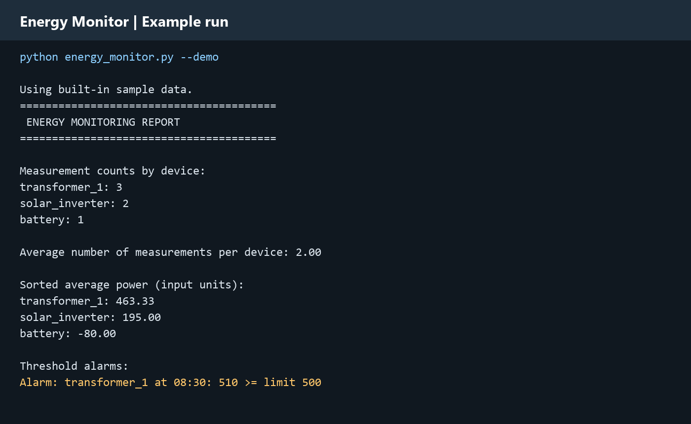
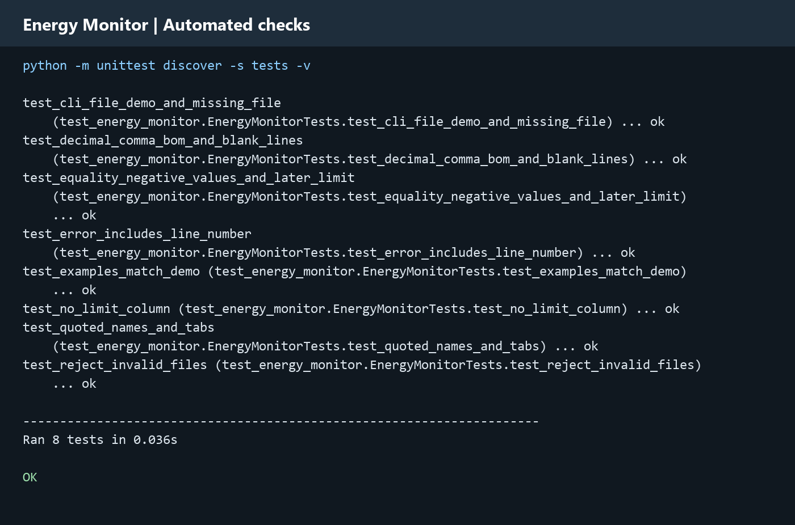

# Energy Monitor

A simple Python tool that turns a TXT or CSV file of power readings into a readable report. See how many readings each device has, compare average power and find when a reading reaches a limit you set.

Created by **Matej Grajžl**.

## What can I use it for?

If you work or study in electronics or energy, you may already have a list of readings from a lab exercise, simulation or measurement log. This program helps you review that data without doing the same calculations by hand.

- **Review a lab experiment:** compare the average power of devices such as a heater, fan or power supply.
- **Check a measurement log:** count readings for each device and spot differences in how much data was collected.
- **Find high readings:** list the recorded times when a device reached or exceeded your chosen power limit.

For example, you could record a heater’s power during an experiment and set a review limit of 150 W. The program will show its average measured power and flag any recorded value of 150 W or more. Choose limits appropriate to your own data; the example values are not equipment ratings.

Files from another tool may need their columns renamed or rearranged to match the simple format below.

## See it working



*This image was rendered from actual program output using the included, invented sample readings. The same output is available as [plain text](sample_output.txt).*

In this example:

- `transformer_1` has three readings: 420, 460 and 510.
- Its average is `(420 + 460 + 510) / 3 = 463.33`.
- The reading at `08:30` triggers an alarm because `510 >= 500`.
- Six readings across three devices give an average of **2 readings per device**. This is a count, not average power.

## Get started

You need **Python 3.10 or later**. No extra Python packages are required.

1. Download the repository ZIP from GitHub and extract it to a normal folder.
2. Open that folder in your terminal or in VS Code. Do not run the program from inside the ZIP.
3. Run the demonstration:

```sh
python energy_monitor.py --demo
```

On Windows, if `python` is not recognized, use `py` instead. On macOS or Linux, your command may be `python3`.

To try loading the included files:

```sh
python energy_monitor.py examples/measurements.csv
python energy_monitor.py examples/measurements.txt
```

Both files contain the same readings as the demonstration.

## Use your own measurements

Create a text file in a text editor, or export a table as CSV. Save it with **UTF-8** encoding. Use these column names in its first row:

| Column | What to enter | Example |
|---|---|---|
| `time` | The recorded time or timestamp | `08:00` |
| `device` | A consistent name for the device | `heater` |
| `power` | The measured power | `120` |
| `limit` | Optional threshold for that device | `150` |

Start with this small example and save it as `my_readings.csv` in the project folder:

```csv
time,device,power,limit
08:00,heater,120,150
08:15,heater,160,150
08:00,fan,30,50
08:15,fan,40,50
```

Then run:

```sh
python energy_monitor.py my_readings.csv
```

You should get **2 readings per device**, an average power of **140** for the heater and **35** for the fan, and one heater alarm at **08:15**. If the input values are in watts, the reported power values are also in watts.

You can also run the program without an argument:

```sh
python energy_monitor.py
```

It will ask for a file path. Paste the full path to your TXT or CSV file, or press Enter to use the sample data. A path is the file’s location on your computer; pasting it does not upload the file anywhere.

## Other supported formats

TXT files can use spaces:

```text
time device power limit
08:00 heater 120 150
08:15 heater 160 150
```

Commas, semicolons and tabs are also supported. For decimal commas, use semicolons or tabs as the separator:

```text
time;device;power;limit
08:00;heater;120,5;150
08:15;heater;160,2;150
```

Use one separator consistently. For device names or timestamps containing spaces, use CSV, semicolons or tabs rather than space-separated TXT. Put quotes around a field if it contains the separator.

Column names can use any letter case and appear in any order. Only `time`, `device`, `power` and optional `limit` are accepted. Blank lines are ignored. Keep device names consistent: `heater` and `Heater` are treated as different devices.

## How do the alarms work?

A reading triggers an alarm when **power is greater than or equal to the limit**. Each device has one limit for the whole file.

For the simplest setup, repeat the same limit on every row for that device. In comma-, semicolon- or tab-separated files, you can leave later limit cells blank. A limit entered on any row applies to all readings for that device. Conflicting limits cause an error.

You can omit the `limit` column entirely if you only want counts and averages. Devices without a limit are listed in the report so you know they were not checked for alarms. Imported files never use the demonstration limits automatically.

Negative values keep their sign. For example, `-80` does not exceed a positive limit of `100`; this is not an absolute-value alarm.

## A few things to know

- Use the **same power unit** for all readings and limits. The program does not convert W to kW.
- Averages give every reading equal weight. They do not account for different time gaps, so irregularly spaced readings do not produce a time-weighted average.
- Times are displayed as supplied, not checked as dates or sorted. Duplicate rows count as separate readings.
- This is a tool for reviewing saved data. It does not read sensors live, control equipment or replace protective devices.
- It calculates average **power**, not energy consumption in **kWh**. Excel `.xlsx` files are not supported directly; export a matching CSV first.
- The file is loaded into memory, so this project is intended for manageable measurement logs.

## Tests

The project includes automated checks for TXT/CSV input, counts, averages, alarm boundaries, decimal commas, missing limits, quoted device names and invalid files.

To run them from the project folder:

```sh
python -m unittest discover -s tests -v
```

All **8 tests passed** during README preparation. The last line `OK` means the checks succeeded.



*Image rendered from a real test run. [View the captured output as text](tests/test_results.txt). These checks cover the included cases, not every possible input.*

## If something goes wrong

| Message or problem | What to check |
|---|---|
| File not found | Extract the ZIP first. Check the path and filename. Relative paths start from your terminal’s current folder. |
| Header error | The first non-empty row must have `time`, `device`, `power` and optionally `limit`. |
| Wrong number of columns | Each row must match the header. Check missing values or extra separators. |
| A value must be a number | Enter numbers only, such as `120.5`, without `W` or `kW`. |
| Conflicting limits | Use the same limit for every row of that device. |
| Text encoding error | Save the file as UTF-8. |

When input is invalid, the program stops with a message rather than showing a report based on only part of the file.

## Project files

- [energy_monitor.py](energy_monitor.py): the commented Python program.
- [examples/measurements.csv](examples/measurements.csv) and [examples/measurements.txt](examples/measurements.txt): ready-to-run sample files.
- [examples/lab_readings.csv](examples/lab_readings.csv): the heater and fan example used above.
- [tests/test_energy_monitor.py](tests/test_energy_monitor.py): the automated checks.
- `images/`: pictures displayed in this README.
